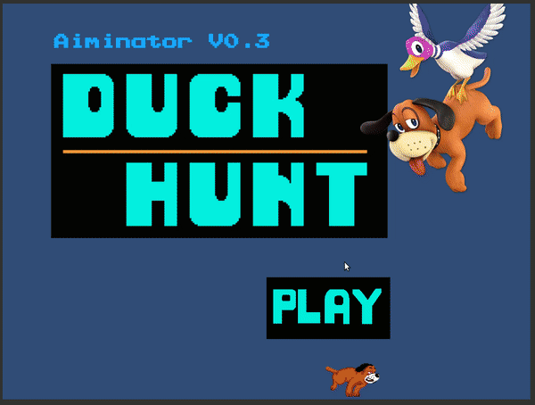

# DuckHunt

## Introduction

[Duck Hunt](https://en.wikipedia.org/wiki/Duck_Hunt) is an 1980' classic Nitendo NES game usinig light gun. This one rebuilds the first game mode of original Duck Hunt.

DuckHunt derived from the experimental prototype [Aiminator](https://github.com/Vagacoder/Aiminator/), and it is Aiminator v0.3.

## Screenshots

## Playable Link

[DuckHunt](https://duckhunt-unity2d.firebaseapp.com/)
